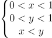

# A toy timed automata for FM-CPS course
## Build
You will need g++-11 and CMake.

```
cd build
cmake .
make
./main
```
## Timed automata description

``clock.h`` -- definition of clock; clock has a name and a value (it could be used for proper simulation).

``cc.h`` -- definition of clock constraint; CC runs a clock simulation and closes when it reaches maxClockVal defined by user. For example, "a<=20" is a CC for a clock "a". For the sake of simplicity, maxClockVals are integers.

``state.h`` -- definition of state; state is a vertex of TA graph with a name of location and some CC defined by user. Clock constraints in locations recognize either "<=" or "<". For example, state "start" with CCs "a<=20" and "b<=25". For the sake of simplicity, in each state user should describe all of the clocks used in the TA.

``step.h`` -- definition of transition in TA; transition runs when specific conditions are met, for example, "a<=13", and resets specific clock (or clocks, if somehow needed). Transitions recognize "<=", "<", ">", and ">=". For the sake of simplicity, the guards should be integers.

``ta.h`` -- definition of timed automata; TA consists of states and transitions between them. 

## Region graph description

A *clock region* is a part of the n-dimensional unit hypercube, where n is the number of clocks, under (or above) the hyperplane defined by relations between clocks in a particular state. For example, region


is defined by 




## Zone graph description

As this implementation uses integer values of clocks instead of real, it's appropriate to consider convex unions of clock regions rather then looking at them separately.

A *clock zone* is a set of clock interpretations described by conjuction of clock constraints, each of which put a lower or upper bound on a clock or on difference of two clocks. Clock zone is a convex set in the n-dimensional euclidean space.

* For two CZs 𝜓 and 𝜑 their intersection is 𝜓∧𝜑;
* For a clock zone ϕ, ϕ ⇑ denotes the set of interpretations ν + δ for ν ∈ ϕ
and δ ∈ IR;
* For a subset λ of clocks and a clock zone ϕ, ϕ[λ := 0] denotes the set of
clock interpretations ν[λ := 0] for ν ∈ ϕ;

With this three operations it is possible to analyze the reachability.

A **zone** is a pair (location, *clock zone*). 

*Zone automation* is a new transition system, which states are zones and transitions are switches.

``zone.h`` -- definition of zone;

``graph.h`` -- definition of the zone graph with reachability check. Zone graph consists of zones.


## TODO
Code optimization and refactoring
 
 